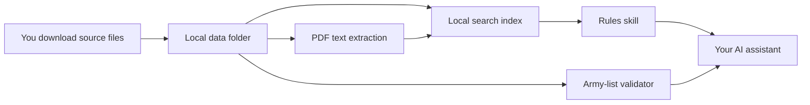

# Techno-Heresy

**A local Warhammer 40,000 rules reference and army-list toolkit.** Bring your own rules files, ask questions through an AI assistant, and check rosters against the points data installed on your computer.

[Get started](START_HERE.md) · [Download and place data](DATA_SETUP.md) · [AI setup handoff](SETUP_WITH_AI.md) · [Architecture](ARCHITECTURE.md)

## What it does

| Capability | Local source | Result |
| --- | --- | --- |
| Rules search | User-supplied Core Rules PDFs, updates, and BSData catalogues | Relevant passages with local file and page references |
| Points lookup | User-supplied BSData Munitorum YAML | Costs with the installed dataset version and date |
| Army-list validation | The same local Munitorum YAML | Point totals, Detachment Points, and checks that still need a person to review |

Techno-Heresy is a pair of [agent skills](.agents/skills/) with small Python tools. Codex can discover the skills from this project; another assistant can use them if it can read local files and run Python. The package has no hosted service, sign-in, billing, AI API integration, crawler, or bundled game data. The scripts that process and search your files make no network requests.

## Get running

1. Follow [docs/START_HERE.md](docs/START_HERE.md) to install Python and open this folder in a local-capable AI assistant.
2. Follow [docs/DATA_SETUP.md](docs/DATA_SETUP.md) to download and place the rules, catalogues, and Munitorum files yourself.
3. Give the assistant [docs/SETUP_WITH_AI.md](docs/SETUP_WITH_AI.md), or run the local commands in the data guide.
4. Ask a rules question or request an army list. The assistant should cite the installed files and state any unverified legality checks.

The search index uses SQLite full-text search. It is created on first use and rebuilt when source files change. No vector database, embeddings service, or API key is needed.

## Trust and scope

BSData is community maintained, so compare important points and disputed rulings with the official sources. This toolkit does not certify a roster for tournament play.

Techno-Heresy is unofficial and is not affiliated with Games Workshop or BSData. The code is [MIT licensed](LICENSE); downloaded rules and community datasets are not covered by that licence. 
